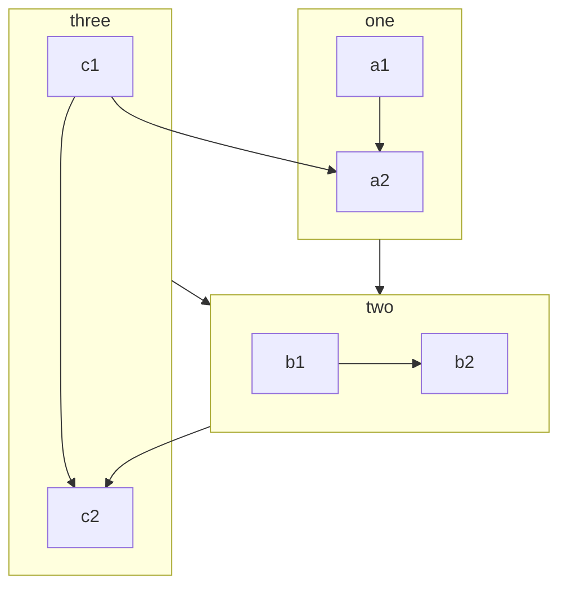

<BiliBili title="以雷霆击碎黑暗"  bvid="BV1k24y1q7p8" low-quality />

<BiliBili bvid="BV1kt411o7C3" low-quality />

<SiKong></SiKong>


<!-- ::: tabs#fruit

@tab github

[github](https://github.com/h7ml)

@tab gitee

[gitee](https://gitee.com/h7ml)

@tab npm

[npm](https://www.npmjs.com/~h7ml)

@tab blog

[blog](https://www.h7ml.cn)

:::-->

## chart

### 一个基础南丁格尔玫瑰图案例

::: echarts 一个基础南丁格尔玫瑰图案例

```json
{
  "legend": {
    "top": "bottom"
  },
  "toolbox": {
    "show": true,
    "feature": {
      "mark": {
        "show": true
      },
      "dataView": {
        "show": true,
        "readOnly": false
      },
      "restore": {
        "show": true
      },
      "saveAsImage": {
        "show": true
      }
    }
  },
  "series": [
    {
      "name": "Nightingale Chart",
      "type": "pie",
      "radius": [20, 100],
      "center": ["50%", "50%"],
      "roseType": "area",
      "itemStyle": {
        "borderRadius": 8
      },
      "data": [
        {
          "value": 40,
          "name": "rose 1"
        },
        {
          "value": 38,
          "name": "rose 2"
        },
        {
          "value": 32,
          "name": "rose 3"
        },
        {
          "value": 30,
          "name": "rose 4"
        },
        {
          "value": 28,
          "name": "rose 5"
        },
        {
          "value": 26,
          "name": "rose 6"
        },
        {
          "value": 22,
          "name": "rose 7"
        },
        {
          "value": 18,
          "name": "rose 8"
        }
      ]
    }
  ]
}
```

:::

## mermaid



```flow
st=>start: 开始|past:>http://www.google.com[blank]
e=>end: 结束|future:>http://www.google.com
op1=>operation: 操作1|past
op2=>operation: 操作2|current
sub1=>subroutine: 子程序|invalid
cond=>condition: 是/否?|approved:>http://www.google.com
c2=>condition: 判断2|rejected
io=>inputoutput: 进行反思...|future

st->op1(right)->cond
cond(yes, right)->c2
cond(no)->sub1(left)->op1
c2(yes)->io->e
c2(no)->op2->e
```

## code

### 一个函数式 React Demo

::: react-demo [react] 一个函数式 React Demo

```js
export default () => {
  const message = '十分帅';

  const handler = () => {
    alert(message);
  };

  return (
    <div className="box">
      h7ml
      <span id="very" onClick={handler}>
        {message}
      </span>
    </div>
  );
};
```

```css
.box span {
  color: blue;
}
```

:::

### Vue Demo

::: vue-demo [vue] 一个 Vue Demo

```vue
<template>
  <div class="box">
    h7ml
    <span @click="handler">{{ message }}</span>
  </div>
</template>
<script>
  export default {
    data: () => ({ message: '十分帅' }),
    methods: {
      handler() {
        alert(this.message);
      },
    },
  };
</script>
<style>
  .box span {
    color: red;
  }
</style>
```

:::

### react-demo 一个类式 React Demo

::: react-demo 一个类式 React Demo

```js
export default class App extends React.Component {
  constructor(props) {
    super(props);
    this.state = { message: '帅' };
  }
  handler() {
    this.setState((state) => ({
      message: `十分${state.message}`,
    }));
  }
  render() {
    return (
      <div className="box">
        <code>h7ml</code>
        <span id="powerful" onClick={this.handler.bind(this)}>
          {this.state.message}
        </span>
      </div>
    );
  }
}
```

```css
.box #powerful {
  color: blue;
}
```

:::

### Vue Composition Demo

::: vue-demo 一个 Vue Composition Demo

```vue
<template>
  <div class="box">
    <code>h7ml</code>
    is
    <span @click="handler">{{ message }}</span>
    !
  </div>
</template>
<script>
  const { ref } = Vue;

  export default {
    setup() {
      const message = ref('powerful');

      const handler = () => {
        message.value = 'very ' + message.value;
      };

      return {
        message,
        handler,
      };
    },
  };
</script>
<style>
  .box span {
    color: red;
  }
</style>
```

:::

### Vue Option Demo

::: vue-demo 一个 Vue Option 演示

```vue
<template>
  <div class="box">
    <code>h7ml</code>
    is
    <span @click="handler">{{ message }}</span>
    !
  </div>
</template>
<script>
  export default {
    data: () => ({ message: 'powerful' }),
    methods: {
      handler() {
        this.message = 'very ' + this.message;
      },
    },
  };
</script>
<style>
  .box span {
    color: red;
  }
</style>
```

:::

### vue-playground Vue 交互演示

::: vue-playground Vue 交互演示

@file App.vue

```vue
<script setup>
  import { ref } from 'vue';

  const msg = ref('你好交互演示!');
</script>

<template>
  <h1>{{ msg }}</h1>
  <input v-model="msg" />
</template>
```

:::

### vue-playground 自定义导入与映射的 Vue 交互演示

::: vue-playground 自定义导入与映射的 Vue 交互演示

@file App.vue

```vue
<script setup>
  import { ref } from 'vue';
  import Comp from './Comp.vue';

  const msg = ref('Hello Playground!');
</script>

<template>
  <h1>{{ msg }}</h1>
  <input v-model="msg" />
  <Comp />
</template>
```

@file Comp.vue

```vue
<script setup>
  import { useBattery } from '@vueuse/core';
  import { ref } from 'vue';

  const { charging, level } = useBattery();
</script>

<template>
  <h1>Battery status</h1>
  <p>Charging: {{ charging }}</p>
  <p>Level: {{ level * 100 }}%</p>
</template>
```

@import

```json
{
  "imports": {
    "@vueuse/core": "https://unpkg.com/@vueuse/core/index.mjs",
    "@vueuse/shared": "https://unpkg.com/@vueuse/shared/index.mjs",
    "vue-demi": "https://unpkg.com/vue-demi/lib/index.mjs"
  }
}
```

@setting

```json
{
  "showCompileOutput": true
}
```

:::
